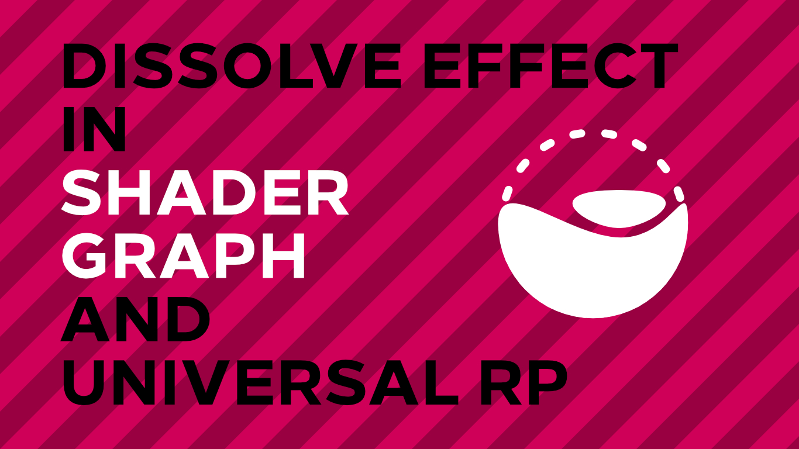

# Dissolve Effect in Unity URP

A dissolve shader for Unity Shader Graph and Universal Render Pipeline.

## Overview

This project contains a dissolve shader graph based on the one created by [Brackeys](https://www.youtube.com/watch?v=taMp1g1pBeE), with the additional feature of being able to modify the dissolve y-coordinate in world-space. The accompanying tutorial is available on [danielilett.com](https://danielilett.com/2020-04-15-tut5-4-urp-dissolve/).

## Software

This project was created using Unity 2019.3.0f6 and Universal Render Pipeline 7.1.8.

## Authors

This project and the corresponding tutorial series were written by Daniel Ilett. [Follow him on Twitter](https://twitter.com/daniel_ilett) for more gamedev tutorials!

## Release

This project was released on April 15th 2020.
